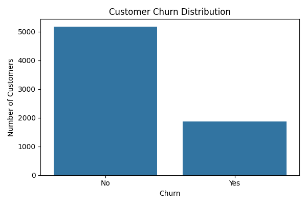
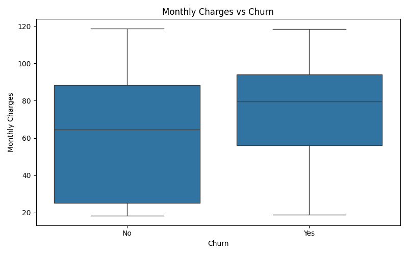
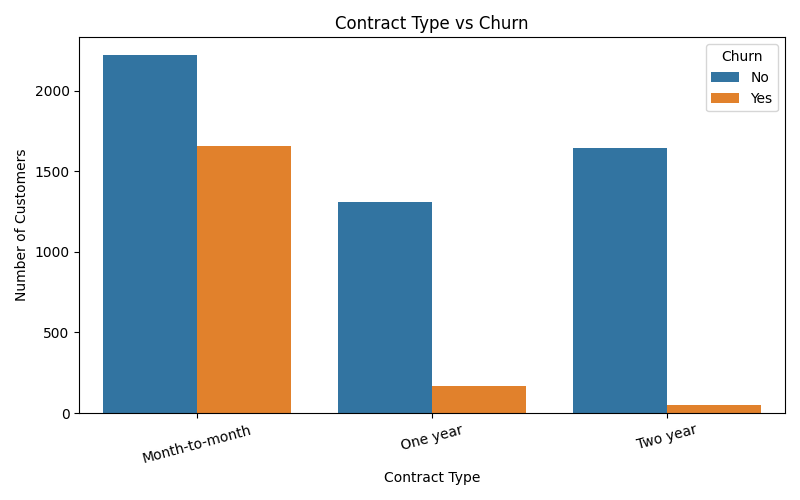
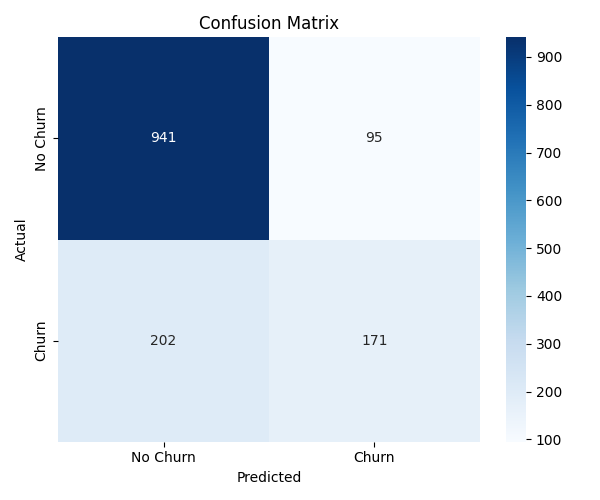
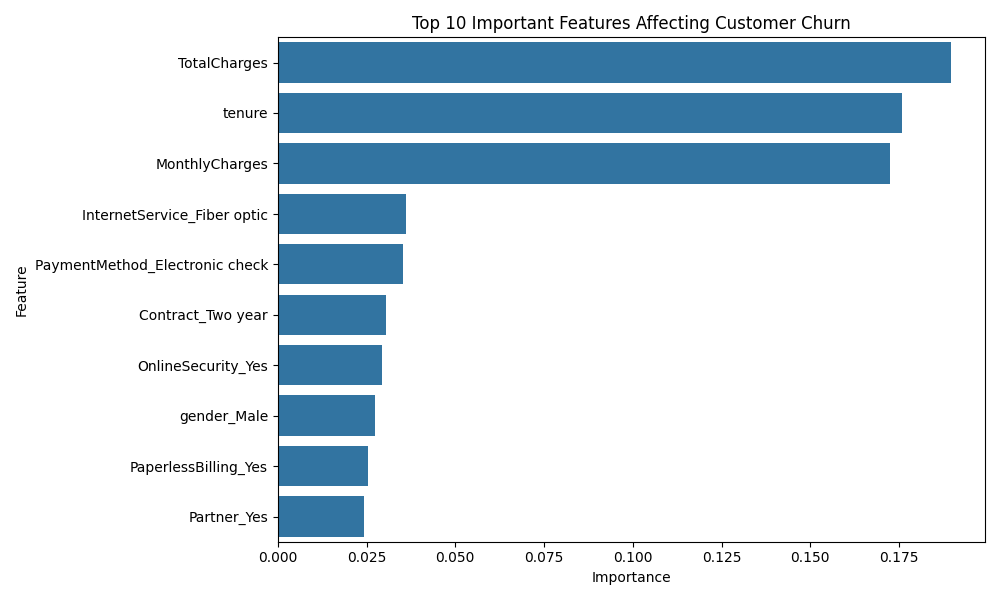

# Customer Churn Prediction

## Project Overview

This project predicts whether a telecom customer is likely to leave the service using Machine Learning.

---

## Technologies Used

- Python
- Pandas
- NumPy
- Matplotlib
- Seaborn
- Scikit-learn

---

## Machine Learning Model

- Random Forest Classifier

---

## Results

| Metric | Value |
|---------|-------|
| Accuracy | **78.92%** |
| ROC-AUC Score | **0.6834** |

---

## Visualizations

### Customer Churn Distribution



---

### Monthly Charges vs Churn



---

### Contract Type vs Churn



---

### Confusion Matrix



---

### Feature Importance



---

## Project Structure

```
Customer_Churn_Prediction
│
├── data
│   └── telco_churn.csv
│
├── images
│   ├── churn_distribution.png
│   ├── monthly_charges_vs_churn.png
│   ├── contract_vs_churn.png
│   ├── confusion_matrix.png
│   └── feature_importance.png
│
├── customer.py
├── README.md
├── requirements.txt
└── .gitignore
```

---

## Author

Sneha Durgam